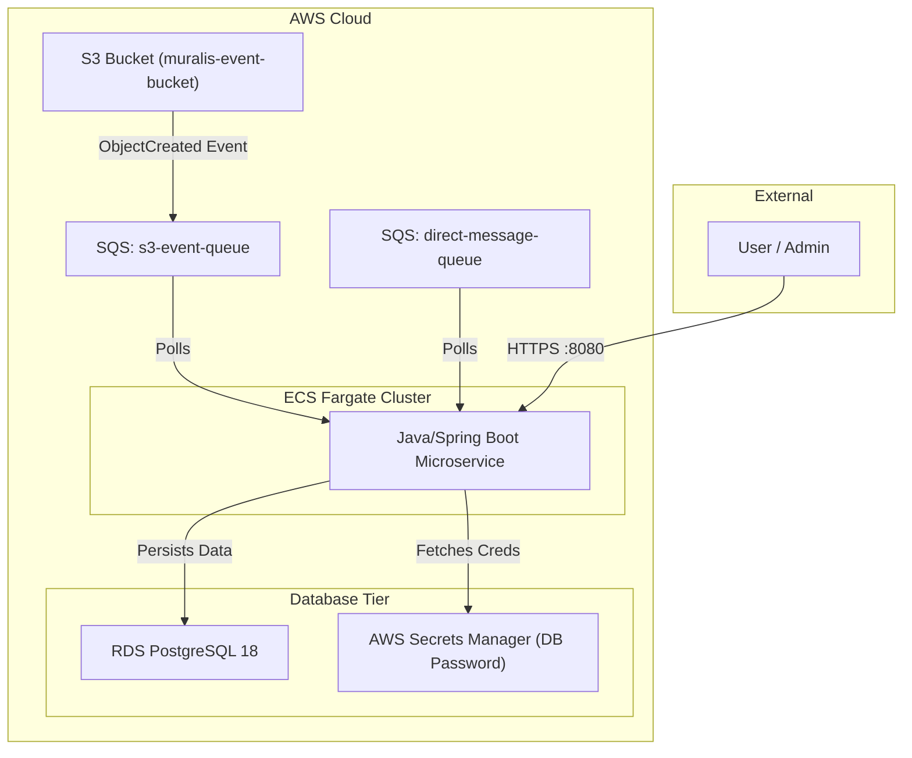

# System Architecture: Event-Driven Microservice

This document outlines the enterprise-grade architecture of the TMS (Task Management System) microservice, incorporating modern best practices for AWS, Security, and Database Management.

## 1. High-Level Architecture

The system follows a reactive, event-driven pattern using AWS managed services for high availability and scalability.

---

## 2. Infrastructure & Deployment (The "Cloud" Layer)

### 2.1 Infrastructure as Code (IaC)
All infrastructure is managed via **Terraform** for reproducibility and environment parity.
- **Modular Design**: Separate modules for `vpc`, `rds`, `ecs`, and `ecr`.
- **Region Portability**: Uses dynamic AWS resource references instead of hardcoded ARNs, allowing for immediate deployment to any global AWS region.
- **Automated Lifecycle**: `iac_create.sh` provisions the entire environment in one command.

### 2.4 Elite Database Bootstrapping (Zero-Touch)
To bridge the gap between infrastructure (Terraform) and application data (PostgreSQL), we use an **Elite Serverless Bootstrapper**:
- **Workflow**: Terraform provisions an AWS Lambda function inside the VPC.
- **Automated Handshake**: Once the RDS instance and Secrets Manager entries are ready, Terraform triggers the Lambda to automatically initialize schemas, roles, and users.
- **Security**: The Lambda has scoped secret-reading permissions and VPC-native connectivity, ensuring zero public exposure of database initialization logic.

### 2.2 Optimized Containerization (Google Jib)
The microservice is containerized using **Google Jib**, which builds images directly to **ECR** without a local Docker daemon.
- **Fast Incremental Builds**: Layer-based caching reduces build times.
- **Improved Security**: Uses a minimal **Amazon Corretto Headless** base image (Amazon Linux 2023), reducing the attack surface by excluding unnecessary shells and utilities.

### 2.3 CI/CD & Scripting Automation
The `cicd.sh` and `iac_create.sh` scripts follow a "Default-with-Override" pattern for the `AWS_REGION` variable. This enables the same codebase to be deployed across different regions (e.g., `us-east-1` for Prod, `us-west-2` for DR) simply by setting an environment variable.

---

## 3. Software Engineering & Development (The "Code" Layer)

### 3.1 Persistence Design
The system uses **Spring JDBC Template** for granular SQL control and maximum performance.

### 3.2 Environment Parity & LocalStack
The system uses **Spring Profiles** to switch between local and cloud environments seamlessly:
- **Local Simulation**: Integrates **LocalStack** to provide a zero-cost, offline-capable AWS environment (S3/SQS).
- **Environment Awareness**: The Java application is designed to be region-agnostic. It detects its hosting region via ECS environment injection (using Spring Profiles), ensuring seamless operation across the AWS global footprint.
- **Parity**: The application code remains identical; only endpoints and configurations change between `local` and `aws`.

---

## 4. Data Architecture (The "State" Layer)

### 4.1 PostgreSQL 18 & Flyway
The database tier uses the latest PostgreSQL 18 engine, with migrations managed by **Flyway** for version-controlled schema evolution.

### 4.2 Role-Based Access Control (RBAC)
Following official PostgreSQL recommendations, we implement a Group-Role hierarchy:
- **Group Roles (NOLOGIN)**: `migration_grp`, `application_grp`, and `developer_grp` act as permission containers.
- **Login Users**: `tmpower` (Flyway), `tmapp` (Runtime), and `tmdev` (Audit) inherit permissions from these groups.

---

## 5. Security & Governance (The "Fortress" Layer)

### 5.1 Network & Data Isolation
- **RDS Security Hardening**: No public internet ingress. The DB only accepts traffic from the **ECS Security Group** and an authorized **Management CIDR**.
- **Schema Isolation**: All data is strictly isolated within `tmschema`. Public schema access has been revoked.

### 5.2 IAM & Least Privilege
- **Task Execution Role**: Uses granular IAM policies to allow only `GetSecretValue` from Secrets Manager and read/write to specific S3/SQS resources.

### 5.3 Secrets Management
Passwords are never hardcoded. They are automatically generated by Terraform, stored in **AWS Secrets Manager**, and injected into tasks at runtime.

---

## 6. Production Readiness Features

The system implements comprehensive production-ready capabilities across operational maturity, monitoring, resilience, and security.

### 6.1 Operational Maturity

**Graceful Shutdown**
- 30-second timeout for in-flight message completion
- Prevents message loss during deployments and ECS task termination

**Health Checks**
- Spring Boot Actuator endpoints: `/actuator/health`, `/actuator/health/liveness`, `/actuator/health/readiness`
- ECS health checks with automatic container restart on failure
- Kubernetes-style probes for orchestration compatibility

**Structured Logging**
- JSON logging for AWS (CloudWatch-friendly)
- Plain text logging for local development
- Standardized log levels (ERROR, WARN, INFO, DEBUG)
- Logstash encoder for consistent log format

### 6.2 Resilience Patterns

**Circuit Breaker (Resilience4j)**
- Sliding window: 10 calls
- Failure rate threshold: 50%
- Wait duration: 30 seconds in open state
- Prevents cascading failures when external APIs are down

**Retry with Exponential Backoff**
- Max attempts: 3
- Wait duration: 1s, 2s, 4s (exponential backoff multiplier: 2)
- Retries only recoverable exceptions (503, network errors)

**Time Limiter**
- 10-second timeout per API call
- Prevents indefinite blocking on slow external services

**Hybrid Error Handling**
- Irrecoverable errors (400, 401, 403, 404) → Direct to DLQ
- Recoverable errors (503, network issues) → SQS automatic retry
- Database errors → Treated as recoverable

### 6.3 Monitoring & Observability

**CloudWatch Alarms**
- DLQ high depth (> 5 messages)
- Queue message age (> 5 minutes)
- ECS high CPU (> 80% for 10 minutes)
- ECS high memory (> 80% for 10 minutes)
- Application errors (> 10 errors in 5 minutes)

**Metrics Export**
- Micrometer CloudWatch registry
- Application metrics to CloudWatch namespace
- Circuit breaker, HTTP, JVM, and JDBC metrics
- Prometheus endpoint for alternative monitoring

**Metric Filters**
- Extracts ERROR log entries
- Creates custom CloudWatch metrics
- Enables log-based alerting

### 6.4 Security & Compliance

**Code Quality**
- Checkstyle (Google Java Style Guide)
- SpotBugs (static analysis)
- JaCoCo (50% minimum code coverage)

**Vulnerability Scanning**
- OWASP Dependency Check (fails on CVSS ≥ 7)
- Trivy container scanning (HIGH and CRITICAL vulnerabilities)
- Automated scanning in CI/CD pipeline

**Secrets Management**
- AWS Secrets Manager for all credentials
- Rotation configuration (30-day cycle, ready to enable)
- No hardcoded passwords or keys

**Network Security**
- VPC isolation for RDS
- Security group restrictions
- IAM least privilege policies
- Schema isolation (tmschema)

### 6.5 Testing Infrastructure

**Testcontainers Ready**
- PostgreSQL container for integration tests
- JUnit 5 integration
- Realistic testing without external dependencies

**Code Coverage**
- JaCoCo plugin configured
- 50% minimum coverage threshold
- HTML reports in `target/site/jacoco/`

### 6.6 Performance Optimization

**SQS Concurrency Control**
- Max concurrent messages: 10
- Max messages per poll: 5
- Prevents database overload

**Connection Pooling**
- HikariCP (Spring Boot default)
- Optimized for high-throughput scenarios

**Idempotency**
- Database-level UNIQUE constraints
- Application-level duplicate detection
- Prevents duplicate processing and wasted API calls

### 6.7 API Documentation

**SpringDoc OpenAPI**
- Interactive Swagger UI at `/swagger-ui.html`
- OpenAPI JSON specification at `/v3/api-docs`
- Auto-generated from code annotations

### 6.8 Infrastructure as Code

**Terraform S3 Backend (Ready)**
- State encryption and locking
- Team collaboration support
- State versioning for rollback
- Configuration ready to enable

**Modular Design**
- Separate modules: VPC, RDS, ECS, SQS, S3, CloudWatch
- Region-portable configuration
- Environment-specific variables

---

## 7. Key Metrics

**Production Readiness**: 89% complete (24 of 27 recommendations implemented)

**Completed Features:**
- ✅ Graceful shutdown
- ✅ Health checks and probes
- ✅ Circuit breaker and retry
- ✅ Structured logging
- ✅ CloudWatch alarms and metrics
- ✅ Security scanning (OWASP, Trivy)
- ✅ Code quality tools
- ✅ Secrets rotation configuration
- ✅ API documentation
- ✅ Test infrastructure

**Remaining Work:**
- Unit and integration test implementation
- Performance/load testing (optional)
- Architecture Decision Records (optional)

---

For additional questions, see [FAQ](faq.md).
